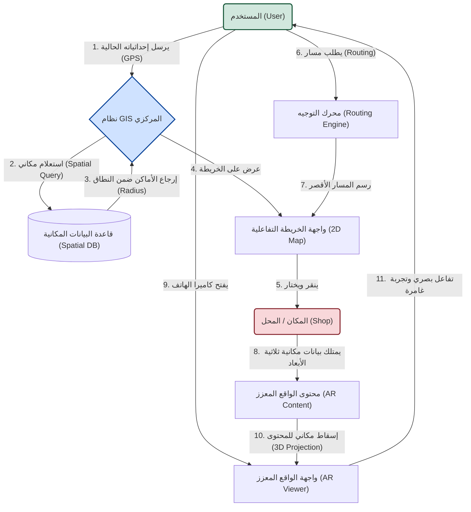
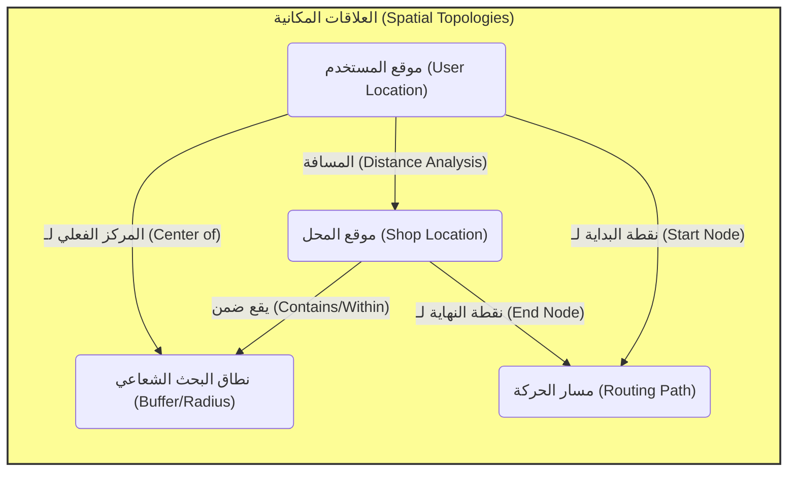
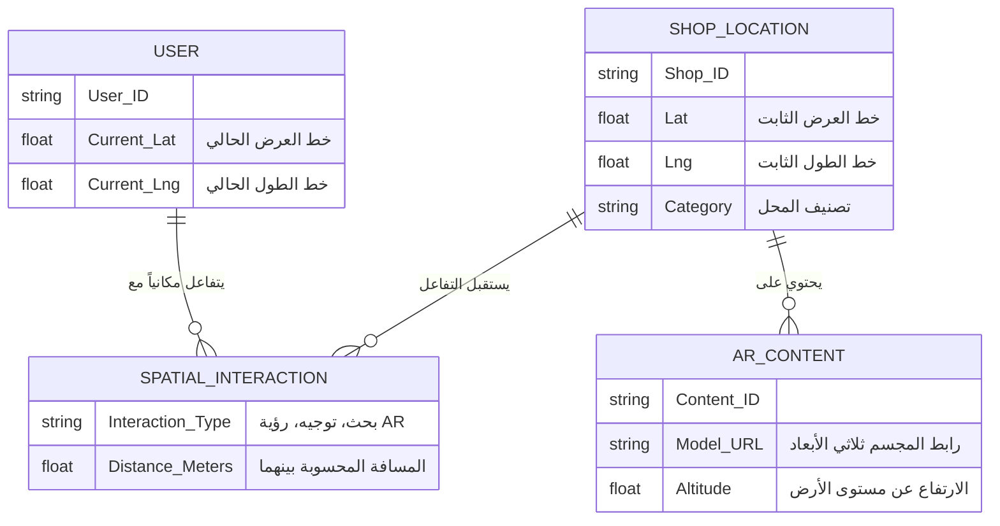

# مخططات سير العمل والعلاقات المكانية (Spatial Relationships Flowcharts)

يوضح هذا المستند من خلال المخططات الانسيابية (Flowcharts) كيف يتفاعل المستخدم مع "المكان" (المحلات/النقاط الجغرافية)، وما هي العلاقات المكانية التي تربط بينهما داخل النظام.

## 1. مخطط تدفق تفاعل المستخدم مع المكان (User-Location Interaction Flow)

هذا المخطط يوضح رحلة المستخدم منذ لحظة تحديد موقعه، مروراً باستعلام النظام عن الأماكن المحيطة، وصولاً إلى التفاعل مع المكان عبر الخريطة ثنائية الأبعاد (2D Map) أو واجهة الواقع المعزز (AR Viewer).

---

## 2. مخطط العلاقات المكانية (Spatial Relationships Diagram)

العلاقات المكانية هي الروابط الهندسية والجغرافية بين موقع "المستخدم" وموقع "المكان/المحل". يوضح هذا المخطط أهم المفاهيم المكانية (Spatial Topologies) التي يعالجها النظام.

### شرح مفصل للعلاقات المكانية في النظام:
1. **المسافة (Distance Analysis):** هي العلاقة الأساسية. النظام يحسب المسافة الإقليدية (أو مسافة هافرسين على سطح الكرة الأرضية) بين إحداثيات المستخدم الحالية وإحداثيات المكان (المحل).
2. **الاحتواء والتداخل (Within / Contains):** المستخدم يشكل حول نفسه "نطاقاً أو دائرة وهمية" (Buffer) نصف قطرها مثلاً (5 كيلومتر). العلاقة المكانية هنا تتأكد مما إذا كان موقع المحل (النقطة الجغرافية) يقع "ضمن" هذا النطاق ليتم عرضه للمستخدم أم لا.
3. **التوجيه والاتصال (Routing / Connectivity):** العلاقة هنا ليست مجرد خط مستقيم، بل هي مسار مرتبط بشبكة الطرق الحقيقية. موقع المستخدم يمثل النقطة (A)، وموقع المحل يمثل النقطة (B)، والنظام يستخرج العلاقة الخطية (المسار) بينهما.

---

## 3. المخطط الكياني للعلاقة بين المستخدم والمكان (ER Diagram)

كيف تترجم هذه العلاقات في هيكل النظام البرمجي وقاعدة البيانات:

